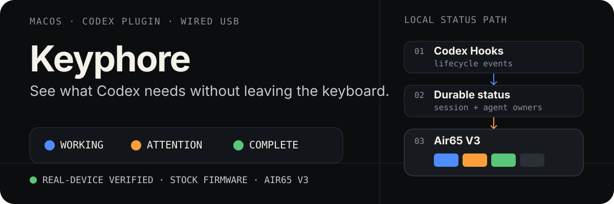

<p align="center"><strong>English</strong> · <a href="./README.zh-CN.md">简体中文</a></p>

<p align="center">
  
</p>

# Keyphore

**See when Codex is working, needs you, or has finished—right on your keyboard.**

Keyphore (pronounced “key-for”) is a native macOS menu bar app that turns Codex task events into NuPhy keyboard backlighting. Configure your signals in the App, then keep working while the keyboard shows the current state.

[Get started](#get-started) · [Compatibility](#compatibility) · [Build from source](#build-from-source) · [GPL v3](#license)

## One glance, three signals

| Default light | What it means |
| --- | --- |
| **Blue · Working** | A Codex task or subagent is executing. |
| **Orange · Attention** | Codex needs your approval or input. |
| **Green · Complete** | A turn finished. The signal lasts five seconds by default. |
| **Off** | No visible task signal is active. |

Concurrent tasks share one keyboard signal: **attention → working → complete → off**. A completed turn cannot hide another task that is still working or waiting for you. Disabling a signal reveals the next eligible state.

*The illustration shows signal states, not a photograph of physical lighting. Actual appearance depends on your keyboard and settings.*

## Make the signals yours

- **Tune each signal independently.** Choose its color, brightness from 1–100%, steady light or slow flashing, and whether it appears at all.
- **Choose how long completion stays visible.** Set it from 1–60 seconds; working and attention follow task activity.
- **Check the keyboard from the menu bar.** See the current signal, connection state, and a keyboard illustration; open settings without a Dock window.
- **Preview on the actual keyboard.** Run a lighting test from the App, check protocol readback, and confirm the result you can see.
- **Use the appearance and language you prefer.** Light, dark, or system appearance; English, Simplified Chinese, or system language.

## Compatibility

| Component | Current support |
| --- | --- |
| Mac | Apple Silicon · macOS 13 or later |
| Codex | Desktop App or CLI with Plugin and Hook support |
| Keyboards | **NuPhy Air65 V3 and Air75 V3**, stock firmware, supported USB identities |
| Connection | Wired USB · one supported keyboard at a time |

Air65 V3 uses USB ID `19f5:102b`; Air75 V3 uses `19f5:1028`. ISO/JIS variants, Bluetooth, 2.4 GHz receivers, Intel Macs, and custom firmware are outside current support. Claude Code and automatic terminal-failure signals are not integrated.

The App can recognize and illustrate additional NuPhy models. **Recognition is not lighting support**: the current experimental lighting allowlist is empty. The [bundled model catalog](./app/Sources/KeyphoreCore/Resources/candidate-keyboards.json) records the recognized identities and layouts.

## Get started

This repository contains the App source. A packaged public download is not linked here yet; use [the source build below](#build-from-source) for development.

Once you have a Keyphore App build:

1. **Open Keyphore and follow Guided setup.** The App manages its Codex Plugin and background component for your macOS user.
2. **Review and approve the Hooks.** Setup presents the eight task-event definitions before enabling them. Follow any macOS permission prompts shown by the App.
3. **Connect one supported keyboard over USB.** Run Signal preview and confirm the visible lighting result.
4. **Start a new Codex task.** Adjust the three signals from Keyphore’s settings whenever you like.

Closing settings leaves Keyphore running. **Quit Keyphore** stops its background component, disables its Hooks, and turns the signal lights off. For removal, use the in-App removal action before trashing the App.

## Prefer a Rust Plugin without the App?

Developers who do not want the macOS App can build the standalone Rust Codex Plugin from [`src/`](./src) and [`Cargo.toml`](./Cargo.toml). It runs a background Companion without a menu bar interface. The Swift App is a separate native implementation, not a wrapper around this Rust binary.

**The Rust route has a narrower scope:** macOS on Apple Silicon, a stock NuPhy Air65 V3 over wired USB, and fixed blue/orange/green signals with a five-second completion window. Do not assume the App’s Air75 V3 support, signal settings, previews, or updater are available in the Rust Plugin. Not using the App does not imply Windows or Linux support.

With a Rust toolchain supporting edition 2024, Xcode Command Line Tools, and a Codex installation with Plugin/Hook support, run these commands from the repository root. They replace the bundled Rust binary with your local build, ad-hoc sign it for local use, and install the Plugin from this checkout:

```bash
cargo build --release --target-dir /private/tmp/codex-builds/keyphore-rust
install -m 755 /private/tmp/codex-builds/keyphore-rust/release/keyphore plugin/bin/keyphore
codesign --force --sign - --identifier keyphore plugin/bin/keyphore
codex plugin marketplace add .
codex plugin add keyphore@keyphore
```

Start a new Codex task and ask:

```text
Use $setup-keyphore to install and validate my NuPhy Air65 V3 status lights.
```

The [bundled setup Skill](./plugin/skills/setup-keyphore/SKILL.md) handles Companion installation, explicit review/trust of the eight Hooks, diagnostics, updates, and removal. Reload Codex as prompted after Hook approval. Building the executable alone does not configure the integration.

**Choose one runtime for the keyboard.** Do not run the Rust Companion and Swift App together. Use the active installation’s removal action before switching; do not manually run a lighting exercise while a Companion owns HID.

The Rust tests also serve as a reference for the Swift implementation. [`tools/keyphore-rewrite-acceptance`](./tools/keyphore-rewrite-acceptance) compares their behavior and audits the App artifact; automated parity is not a substitute for physical lighting confirmation.

## Local by design

Keyphore has no product account or cloud sync and does not automatically upload telemetry or diagnostics. Its Hook handlers retain only allowlisted event and task-identity fields, not prompts, conversation text, or tool content. Diagnostic exports are reviewed and saved locally by you.

```text
Codex task events → local task state → Companion → keyboard backlight
```

The Companion is the only component that opens the keyboard’s HID connection. It combines active task signals, applies your settings, and verifies lighting writes through protocol readback. The supported lighting profiles preserve the separate side/rhythm-light state. Keyphore’s idle state turns its main-backlight signal off; it does not restore a previous lighting effect.

## Build from source

The App, its Hook runtime, and its Companion are written in **Swift 6**. The separately buildable Rust Plugin also serves as a behavioral reference; it is not embedded in the App.

Core tests require a Swift 6 toolchain:

```bash
swift test --package-path app --scratch-path /private/tmp/codex-builds/keyphore-core
```

Build the App with Xcode on Apple Silicon:

```bash
xcodebuild -project Keyphore.xcodeproj -scheme Keyphore \
  -configuration Debug \
  -derivedDataPath /private/tmp/codex-builds/keyphore-app \
  build
```

For maintainers opening a development build or testing a physical keyboard, use the repository’s stable installation workflow:

```bash
tools/keyphore-development-app build-open
```

That workflow requires the configured signing identity and `codex-temp-guard`. It checks for an existing Companion before installing in `~/Applications/Keyphore.app`. Do not launch a development App directly from DerivedData. After hardware testing, quit through the App so it can turn the signal off and stop the Companion.

<details>
<summary>Code map and validation boundaries</summary>

| Path | Purpose |
| --- | --- |
| [`app/Sources/KeyphoreApp`](./app/Sources/KeyphoreApp) | Menu bar, settings, Guided setup, diagnostics, updates |
| [`app/Sources/KeyphoreCore`](./app/Sources/KeyphoreCore) | Task state, signal profiles, lifecycle, USB protocol |
| [`runtime/Sources`](./runtime/Sources) | Swift Hook handler and Companion entry points |
| [`app/Tests`](./app/Tests) | Core and App contracts |
| [`src`](./src) | Standalone Rust Plugin and behavioral reference |

[`tools/keyphore-rewrite-acceptance`](./tools/keyphore-rewrite-acceptance) collects software and parity evidence. Automated tests and protocol readback do not replace physical lighting confirmation. The [original Air65 V3 acceptance record](./docs/acceptance/issue-9.md) describes that earlier hardware check; it is not an Air75 V3 acceptance report.

</details>

## Updates

The App uses a signed Sparkle feed in [`updates/appcast.xml`](./updates/appcast.xml). Versioned installers belong in GitHub Releases; English and Simplified Chinese notes live in [`updates/notes`](./updates/notes). The initial feed contains no release until a signed, notarized installer is ready. Online updates require the repository and Release assets to be publicly accessible.

Maintainers: `tools/keyphore-release build` reads the feed URL and public key from [`release/Updates.xcconfig`](./release/Updates.xcconfig), with separate `--feed-url` and `--download-url` overrides. `stage` takes `--notes-en` and `--notes-zh-hans`, signs the feed, and prepares `public/updates` for the repository and `public/release-assets` for GitHub Releases, including corresponding source. Build from committed source. Publish the versioned assets before updating the feed; retain old assets and increase the version and build numbers for each release. Signing uses the `com.barrywu.keyphore` Keychain account; never commit its private key.

## License

Keyphore’s first-party code, including the Swift App, Companion, and bundled Plugin, is licensed under the [GNU General Public License v3.0 only](./LICENSE) (`GPL-3.0-only`). When distributing covered binaries, provide their corresponding source under the license terms.

Third-party components retain their original licenses and attribution: [NuPhyIO protocol notice](./LICENSES/NUPHYIO-NOTICE.txt) · [Sparkle and bundled dependencies](./app/Sources/KeyphoreCore/Resources/SPARKLE-NOTICE.txt).
